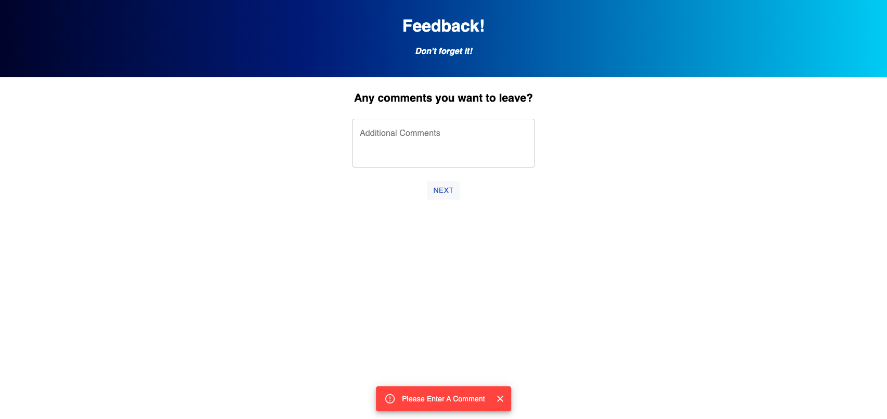

# Project Name

Redux - Feedback Form

## Description

_Duration: Weekend Challenge_

The fifth weekend challenge of Prime Digital Academy. The challenge was to use React.js/Redux to create a multi-page feedback form for students. This form will keep all of the submitted answers in an object in a reducer, and when the user submits the form, that object will then be stored in a database.

## Screenshot

*One of the input pages*

*The comments page with an error*

### Prerequisites

- [Node.js](https://nodejs.org/en/)
- [React.js](https://reactjs.org/)
- [Redux](https://redux.js.org/)
- [postgresql](https://www.postgresql.org/)
- [Postico](https://eggerapps.at/postico/)

## Installation

1. Download code from Github
2. Open the folder in an editor of your choice
3. Run an 'npm install' in your terminal
4. Run 'npm install pg' to install postgresql
5. Create a Database called "prime_feedback" (using Postico)
6. Using the database.sql code, create a table in the database
7. Run 'npm run server' in your terminal to start the server
8. Run 'npm run client' in another terminal to start the React Server
9. React will open your default browser to localhost:3000!

## Usage

1. Click the start button to start the feedback form
2. On the next three pages, select a radio input between 1 and 5
3. On the comments page, write in any additional comments you may have
4. Review your answers and submit

Stretch - Admin page

1. Navigate to localhost:3000/#/admin
2. See all of the submitted feedback

## Built With

HTML // CSS // Javascript // React.js // Redux // Material-UI // node.js 

## License

[MIT](https://choosealicense.com/licenses/mit/)

## Acknowledgements

Thanks to [Prime Digital Academy](www.primeacademy.io), and specifically Myron Schippers, Edan Schwartz, and Chad Smith who equipped me with the knowledge that helped me to make this application a reality.
